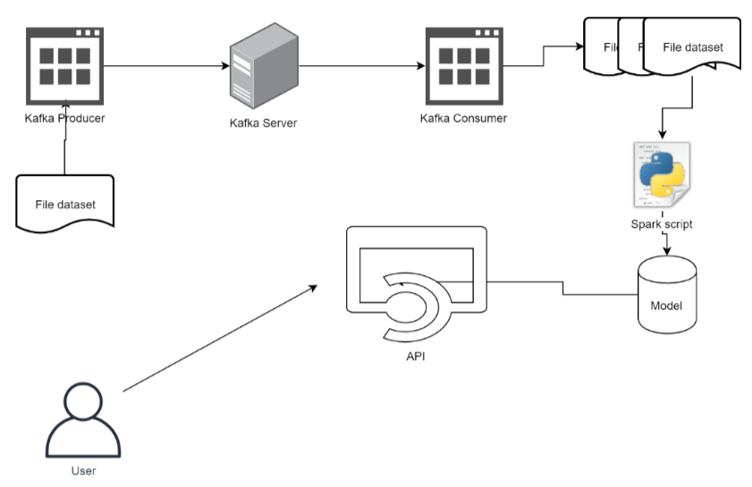

# Final Project

## Topic

> Community Detection using Label Propagation Algorithm (LPA) on Twitter Network

## Dataset

[Twitter-Dynamic-Net](https://aminer.org/data-sna#Twitter-Dynamic-Net)

### Overview
We crawled a twitter dataset. To begin the collection process, we selected the most popular user on Twitter, i.e., “Lady Gaga”, and randomly collected 10,000 of her followers. We took these users as seed users and used a crawler to collect all followers of these users by traversing “following” relationships and these followers are viewed as the user list and the total number is 112,044. The crawler monitored the change of the network structure among the 112,044 users from 10/12/2010 to 12/23/2010 and finally obtained 443,399 dynamic “following” relationships between them.

Tweets were crawled for those users from Jan1, 2010 to Oct, 2010 and from Oct 1, 2010 to Jan 15, 2010.

### Description

There are totally 443,399 follow relationships.

### Data format

- [graph_cb.txt](data/graph_cb.txt)
	- First column: person id 1
	- Second column: person id 2
	- Third column: the timestamp when the person 1 follows person 2

   Sample lines:
   
   ```txt
   0 11 1
   0 4893 1
   ```

- [user_list.txt](data/user_list.txt)
    
    The number `k` on the `i`th (start from 0) line represents mapping the original user id `k` to the new id `i`.

- [user_map.txt](data/user_map.txt)

  format:
    
  ```txt
  original_user_id username
  ```

### Data Flow



### API


#### Get All Users (`GET` `/users`)

- Body Parameters:
	- `None`
- Response:
	- `"models": [ /* list of users */ ]}`
- Errors:
	- `None`

#### Get All Models (`GET` `/models`)

- Body Parameters:
	- `None`
- Response:
	- `"models": [ /* list of models */ ]}`
- Errors:
	- `None`

#### Get Friends (`POST` `/get-friends`)

- Body Parameters:
	- `username`: `str`
	- `model`: `str`
- Response:
  ```
  {
      "friends": ["dogcatbirdspet"],
      "model_filename": "data\\models\\comm_0.csv",
      "user_id": 100009184,
      "username": "dogcatbirdspet"
  }
  ```
- Errors:
	- `{"error": "model does not exist"}`
	- `{"error": "username does not exist"}`

#### Get Members (`POST` `/get-members`)

- Body Parameters:
	- `community`: `str`
	- `model`: `str`
- Response:
  ```
  {
      "community": 1342
      "members": ["dogcatbirdspet"],
      "model_filename": "data\\models\\comm_0.csv",
  }
  ```
- Errors:
	- `{"error": "model does not exist"}`
	- `{"error": "community does not exist"}`

#### Get Community (`POST` `/get-community`)

- Body Parameters:
	- `username`: `str`
	- `model`: `str`
- Response:
  ```
  {
      "community": 1342,
      "model_filename": "data\\models\\comm_0.csv",
      "user_id": 100009184,
      "username": "dogcatbirdspet"
  }
  ```
- Errors:
	- `{"error": "model does not exist"}`
	- `{"error": "username does not exist"}`